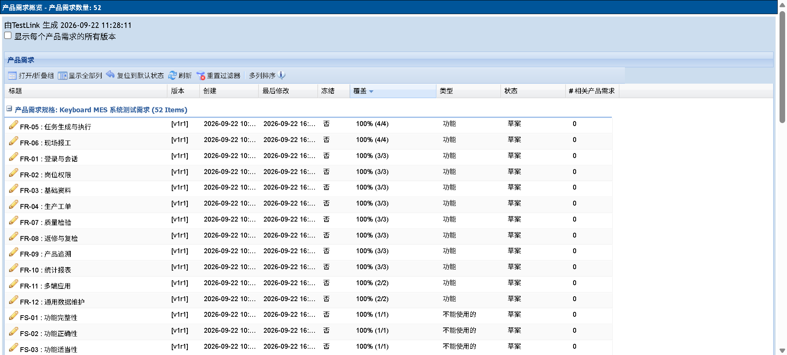
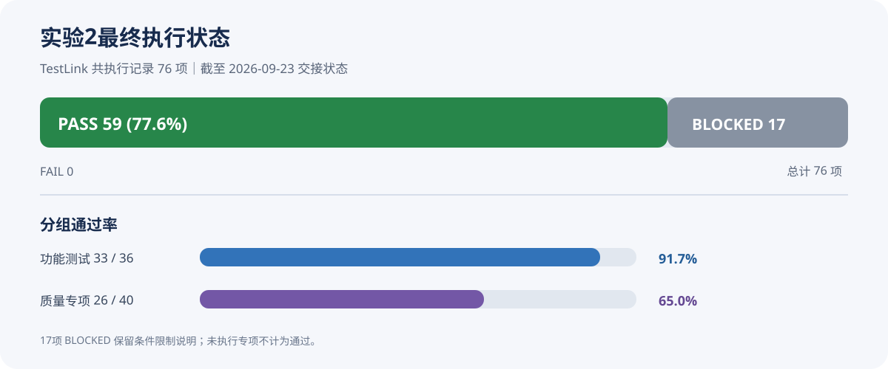

Keyboard MES 系统测试报告

课程：软件测试与质量保证　　实验：上机2 软件测试管理　　项目：第22组

测试对象：Keyboard MES 键盘装配制造执行系统

测试计划与构建：Keyboard MES 系统测试计划 v1.0　/　LAB2-B01　　测试日期：2026年9月22日

结果统计截至：2026年9月23日　　文档修订：2026年10月8日

小组成员

| 姓名 | 学号 |
| --- | --- |
| 乔通 | 2407020419 |
| 李政良 | 2407020415 |
| 昝泓志 | 2407020416 |
| 徐西岳 | 2407020417 |
| 王佳欣 | 2407020407 |

一、测试概况

本报告记录 Keyboard MES 在隔离环境中的系统测试执行情况。测试对象覆盖 Web 管理端、微信小程序现场端、Spring Boot 后端及 MySQL、Redis 集成行为，围绕登录与岗位权限、基础资料、工单任务、报工、检验、返修复检、SN 追溯、统计报表和质量特性开展验证。

本轮测试按 TestLink 测试计划 v1.0、构建 LAB2-B01 执行。计划包含 52 项需求和 76 项用例，其中 36 项功能测试、40 项质量专项。报告同时区分 TestLink 状态记录覆盖率、执行完成率和用例通过率，BLOCKED 不计为已完成或通过。

1.1 测试依据与范围

主要依据为课程上机安排及上机2任务说明、Keyboard MES 需求规约、上机1质量需求设计、系统测试计划 v1.0、系统测试用例和需求追踪矩阵。功能验证关注业务状态、数量约束、权限和数据一致性；质量专项覆盖功能适用性、性能效率、兼容性、交互性、可靠性、安全性、可维护性、灵活性和保护性。

测试范围不包括与真实 ERP、PLC、实体检测设备、安全联锁的端到端集成；需要真人、真机或长期观察的项目按实际条件保留阻塞状态。

二、测试环境与管理配置

2.1 软件与数据环境

| 项目 | 实际配置 |
| --- | --- |
| 操作系统与运行时 | Windows 11；JDK 17；Spring Boot（Maven）；Vue 3 + Vite |
| 业务数据服务 | MySQL 8.4.3；Redis 5.0.14，逻辑库 15 |
| 隔离数据库 | keyboard_mes_lab2；测试数据与原有业务库隔离 |
| 测试管理工具 | TestLink 1.9.20 fixed；XAMPP Apache 2.4.58；PHP 8.2.12 |
| TestLink 数据库 | testlink_lab2；MES 测试计划 ID=108，构建 LAB2-B01 |
| 代码基线 | MES 代码提交号未在执行报告中留存，复现实验时需补录 |

执行期间使用独立测试数据库；各阶段服务状态随实验启停变化，后续复测须重新检查环境，不将历史交接状态作为当前运行状态。

2.2 TestLink 项目与追踪关系

TestLink 项目为“Keyboard MES 系统测试”，前缀 KMES。需求规格 KMES-SRS 导入 52 项需求；功能测试和质量专项两个用例集共导入 76 项用例；需求与用例追踪关系逐项核对。测试计划 ID=108，执行构建为 LAB2-B01。

图1　TestLink 需求覆盖视图：52 项需求均关联了测试用例

三、执行结果与覆盖情况

3.1 总体执行统计

| 指标 | 结果 | 统计口径 |
| --- | --- | --- |
| 需求追踪覆盖 | 52/52 = 100% | 52 项纳入需求均至少关联一条有效用例 |
| 状态记录覆盖 | 76/76 = 100% | 所有计划用例均有 PASS、FAIL 或 BLOCKED 状态 |
| 执行完成率 | 59/76 = 77.6% | (PASS + FAIL) / 计划用例数；BLOCKED 不计完成 |
| 用例总体通过率 | 59/76 = 77.6% | PASS / 计划用例数 |
| 已执行用例通过率 | 59/59 = 100% | PASS / (PASS + FAIL)，不代表全部范围已完成 |
| 失败用例 | 0 项 | 缺陷修复后关联用例均已回归通过 |
| 阻塞用例 | 17 项 | 因专项人员、设备、时间或环境条件不足未完成 |

| 测试类别 | 计划数 | PASS | FAIL | BLOCKED | 按计划数通过率 |
| --- | --- | --- | --- | --- | --- |
| 功能测试 F001-F036 | 36 | 33 | 0 | 3 | 91.7% |
| 质量专项 Q001-Q040 | 40 | 26 | 0 | 14 | 65.0% |
| 合计 | 76 | 59 | 0 | 17 | 77.6% |

图2　LAB2-B01 执行状态分布及统计口径

3.2 高优先级及质量类别结果

高优先级用例共 49 项，其中 46 项通过、3 项阻塞（F031、Q018、Q023），按计划数通过率为 93.9%。功能用例 33/36 通过，质量专项 26/40 通过。100% 的状态记录覆盖只表示每项已有状态，不代表全部用例均已实际执行。

质量专项中，性能、可靠性、安全性、可维护性等部分场景已由测试人员和 F 线自动化脚本补测；需要长期观测、真人评价、微信小程序客户端或多环境安装的专项未用短时接口请求代替，继续保留 BLOCKED。

四、典型测试结果与缺陷回归

4.1 代表性执行结果

| 用例 | 测试点与条件 | 实际结果 | 状态 |
| --- | --- | --- | --- |
| F018 | 计划 100、累计完成 0，提交报工 150 | 接口返回 400，提示报工量超过剩余计划量，未形成超量累计 | PASS（修复后回归） |
| F019 | 累计完成量小于计划量时提交完工 | 接口拒绝完工并返回未达计划数量信息 | PASS（修复后回归） |
| F026 | 启用质量门的工序完成报工并尝试完工 | 任务进入待质检状态，未被直接置为已完工 | PASS（修复后回归） |
| Q004 | 50 虚拟用户运行 60 秒，记录 30,158 个请求 | 平均响应 90.78 ms，P95 223.6 ms，P99 269 ms | PASS（执行记录） |
| Q017 | 循环请求当前用户接口 10,000 次 | 10,000 次成功，未记录错误，总耗时 13.78 秒 | PASS |
| Q019/Q020 | 停止 Redis 后观察业务与恢复 | JVM 未退出；Redis 恢复后业务恢复，记录恢复时间小于 30 秒 | PASS |

图3　功能测试首轮执行统计（修复前）：36 项功能用例中 3 项失败，后续已修复并回归

4.2 高严重度缺陷及回归

| 缺陷编号 | 问题表现 | 修复与回归结果 |
| --- | --- | --- |
| BUG-001 报工超量 | 报工提交前未校验报工数量是否超过任务剩余计划量，可能造成累计量超计划 | 增加剩余数量边界校验；F018、Q002、Q036 等关联场景回归通过 |
| BUG-002 提前完工 | 任务累计完成量未达到计划数量时仍可被标记为完工 | 增加完工条件校验；F019 及相关状态场景回归通过 |
| BUG-003 质量门绕过 | 启用质量门的任务完工后未进入待质检状态 | 完工逻辑读取工艺路线质量门配置；F026 及关联质量场景回归通过 |

上述 3 项高严重度缺陷均已修复。5 项关联用例 F018、F019、F026、Q002、Q036 复测通过；测试记录中的 FAIL 状态已依据实际修复回归更新为 PASS。

五、阻塞项与计划退出条件评估

| 阻塞类别 | 用例数 | 代表项目 | 无法完成的条件 |
| --- | --- | --- | --- |
| 周期边界 | 1 | F031 | 需要跨越至少 30 天的真实周期数据，单次实验无法替代观察 |
| 小程序与真机 | 3 | F033、F034、Q008 | 需微信开发者工具/小程序客户端及 Android、iOS 真机配合 |
| 多工具协同 | 1 | Q007 | 需在同一终端并行比较 MES 与其他实际办公应用 |
| 用户交互评价 | 7 | Q009-Q011、Q013-Q016 | 需组织 10 名真实用户按任务操作并记录量表 |
| 长期可靠性 | 1 | Q018 | 要求 22 个工作日、每日 8 小时的稳定性观察 |
| 操作审计记录 | 1 | Q023 | 需部署操作日志/审计能力并取得对应记录 |
| 跨环境兼容 | 3 | Q033-Q035 | 需独立环境、可迁移数据及新成员安装复现条件 |
| 合计 | 17 |  | 均已记录阻塞原因，尚未完成专项验证 |

5.1 原计划退出标准评估

| 退出条件 | 结果 | 说明 |
| --- | --- | --- |
| 高优先级用例全部执行且通过 | 未满足 | 49 项中 46 项 PASS、3 项 BLOCKED |
| 计划用例执行完成率 100% | 未满足 | 59/76 = 77.6%；17 项 BLOCKED 不计为完成 |
| 总体通过率不低于 95% | 未满足 | 按计划总数计算为 59/76 = 77.6% |
| 严重/致命缺陷为 0 | 满足（修复后） | BUG-001 至 BUG-003 已修复，关联回归通过 |
| 剩余问题完成影响评估与处置 | 部分满足 | 阻塞原因已记录，未留存正式评审签字或会议纪要 |
| 整体退出结论 | 未通过 | 执行完成率、通过率和高优先级全通过条件未满足 |

六、后续实验验证与综合评估

在系统测试结果留档后，小组继续开展单元测试、静态分析、接口测试和查询负载测试。下述结果属于各自日期、范围和环境下的补充验证，不直接改变LAB2-B01的用例状态；不同工具的请求数、断言数及覆盖率也不合并计算。

单元测试与覆盖率

实验3留档结果为19个测试类、96项测试通过。六个核心服务的JaCoCo行覆盖率为99.4%，分支覆盖率为91.8%，达到既定核心服务目标。该结果不代表整个后端达到同等覆盖率，报表等扩展服务仍有测试缺口。2026年10月8日完成静态分析问题修正后，同一套96项测试再次全部通过；本次回归没有重新采集覆盖率。

静态分析与问题修正

阿里规约初次发现208项不符合，修正后同范围复查为0项。FindBugs 3.0.1经记录明确的字节码解析兼容适配，对72个源文件对应的73个类完成扫描，核查8项告警，修正7项源码问题，复查保留1项编译器生成代码的误报。该工具副本并非官方Java 17支持版本，结果适用于本次启用的检测能力。

接口与查询负载验证

实验5使用Postman集合和Newman，对工单、生产任务和生产报表三类服务开展验证，最终10个请求、20项断言全部通过。实验6的单用户基线和十用户负载共执行652个请求，HTTP和业务断言均通过；Badboy另行录制4个公共只读请求，原生脚本、原始JMX及补充响应断言版本均通过实际回放。上述场景没有覆盖业务写入、所有岗位权限或长期可靠性，不能外推为生产容量结论。

系统测试退出评估

补充实验增加了代码质量、核心逻辑和所测接口的验证依据，但尚未满足真人、真机、跨环境和长期观察等专项条件。因此本报告仍保留59项PASS、17项BLOCKED和77.6%的执行完成率，整体退出准则仍未通过。Q006既有执行日志中的成功率与状态口径差异也未由短时查询负载替代解决。

七、结论与后续工作

本轮已完成 TestLink 需求、用例、计划及构建配置，并在隔离 MES 环境执行了部分功能和质量专项测试。52 项需求均建立用例关联；59 项已完成用例全部通过，3 项高严重度缺陷已修复并完成关联回归。

系统测试整体退出准则未通过。76 项用例中仍有 17 项 BLOCKED，执行完成率和按计划用例数计算的总体通过率均为 77.6%，高优先级用例中仍有 3 项阻塞。因此本报告不将本轮结果表述为 Keyboard MES 整体测试通过。

• 准备真人用户、微信小程序客户端、Android/iOS 真机、长期观察周期和独立兼容环境，逐项补测 17 项阻塞用例。

• 复测时补录 MES 代码提交号、工作区变更、浏览器/设备、数据基线及实际执行人员，形成可复现的构建记录。

• 对 Q006 容量记录作专项复核：TestLink 状态记录为 PASS，但执行日志同时记录成功率 86% 且受 Windows 客户端 TIME_WAIT 资源影响；应在独立发压端复测后再形成容量结论。

• 正式评审记录或签字如为课程提交要求，应由小组按真实情况补充，不以本报告代替审批记录。
