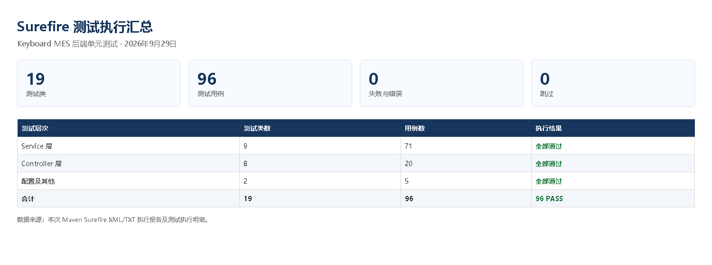
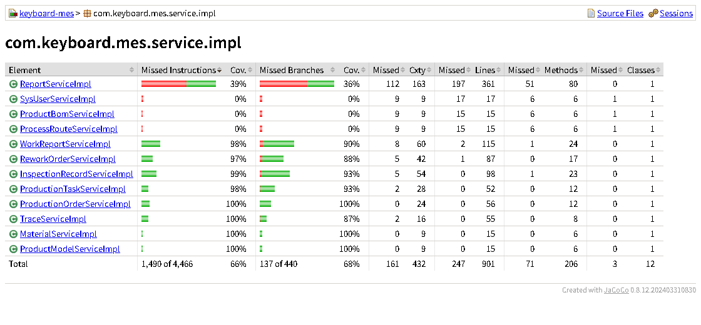

# 实验3 单元测试实验报告

课程：软件测试与质量保证  
实验：上机3 JUnit、Mockito 与 JaCoCo 单元测试  
测试对象：Keyboard MES 键盘装配制造执行系统后端  
时间：2026年9月

## 小组成员

| 姓名 | 学号 |
| --- | --- |
| 乔通 | 2407020419 |
| 李政良 | 2407020415 |
| 昝泓志 | 2407020416 |
| 徐西岳 | 2407020417 |
| 王佳欣 | 2407020407 |

## 1 实验目的与要求

本实验按照上机3的要求，使用 JUnit 为 Keyboard MES 后端设计并执行单元测试，对调用关系较复杂的业务方法结合 Mockito 隔离依赖，使用 JaCoCo 检查测试覆盖情况。测试设计围绕语句覆盖、分支覆盖和基本路径覆盖展开，重点检查工单生成、任务流转、报工、质检、返修复检及 SN 追溯中的业务规则。

实验1中的 MA-05 质量需求规定，核心服务的语句覆盖率不低于85%，分支覆盖率不低于80%。本实验以六个核心服务为检查范围，按照这一目标补充正常、边界及异常用例，并对测试结果和未覆盖部分进行分析。

单元测试主要验证服务方法的输入校验、状态转换和异常处理。对于 Mapper 等依赖，使用 Mockito 设置返回值并验证调用，使每个用例能够在明确的前置条件下执行。

## 2 实验环境与测试方法

| 项目 | 本次配置 |
| --- | --- |
| Java 与构建 | JDK 17；Maven 3.9.9 |
| 测试框架 | JUnit 5、Mockito、AssertJ |
| 覆盖率工具 | JaCoCo Maven 插件 0.8.12；Surefire 执行测试 |
| 运行方式 | 通过 Maven 统一运行后端单元测试 |
| 结果检查 | Surefire 测试执行报告、JaCoCo HTML 覆盖率报告 |

JUnit 负责组织和执行测试，AssertJ 用于断言业务结果，Mockito 用于模拟依赖和检查方法调用。例如，非法报工用例不仅检查是否抛出异常，还验证报工记录未被写入；合法报工用例则检查保存的数据和任务状态是否符合预期。测试不需要启动 MySQL、Redis 或完整的 MES 服务。

本实验以代码行覆盖率近似反映语句覆盖情况，以分支覆盖率检查判断的不同结果是否得到测试。一行代码可能包含多条语句，因此代码行覆盖率与语句覆盖率并不完全等同。服务层测试直接检查业务方法，控制器层测试则检查请求处理与响应结果，两者分别评价。

## 3 白盒测试设计

### 3.1 基本路径分析

选取报工服务中的 `validateReportQuantity` 方法进行基本路径分析，并通过提交报工的业务入口执行测试。该方法依次检查报工数量是否为正、合格数和不良数是否非负、数量是否守恒，以及报工数量是否超过任务剩余量。任一条件不满足即拒绝报工，全部校验通过后才允许保存记录。

将各判断依次记为 D1 至 D5，其中 D2 和 D3 分别对应短路表达式中的两个判断。按这一控制流划分，环路复杂度 V(G)=5+1=6，需要设计六条独立基本路径。测试中设任务计划数为10、已完成数为4，剩余可报工数为6，各路径的输入与预期结果如下。

| 路径 | 报工数 / 合格数 / 不良数 | 首个成立判断 | 预期结果 | 对应用例 |
| --- | --- | --- | --- | --- |
| P1 | 0 / 0 / 0 | D1 | 拒绝非正报工数 | 数量校验测试第1组 |
| P2 | 2 / -1 / 3 | D2 | 拒绝负合格数 | 同上第2组 |
| P3 | 2 / 3 / -1 | D3 | 拒绝负不良数 | 同上第3组 |
| P4 | 2 / 1 / 0 | D4 | 拒绝数量不守恒 | 同上第4组 |
| P5 | 7 / 7 / 0 | D5 | 拒绝超过剩余数6 | 同上第5组 |
| P6 | 6 / 5 / 1 | 无 | 接受报工，累计完成数变为10 | 合法报工测试 |

P1 至 P5 分别使一个校验条件首次不满足，覆盖五条拒绝路径。测试断言相应异常，并验证未调用报工记录的写入方法。P6 使用恰好等于剩余量的合法输入，通过全部校验，检查记录保存及累计完成数更新。六组输入分别对应六条独立基本路径。

### 3.2 其他业务用例设计

| 对象 | 本次检查的关键行为 |
| --- | --- |
| 工单与任务 | 启用路线生成任务、重复生成保护、任务未达计划拒绝完工、质量门进入待质检、缺失路线处理 |
| 报工 | 数量守恒、非负与剩余量边界、正常完工、普通工序与质量门工序的状态差异、写入失败 |
| 质检 | 合格完工、不合格生成返修单、处置方式触发返修、关联工单不匹配及写入失败 |
| 返修复检 | 维修后待复检、复检成功关闭、复检失败返回维修、关联记录缺失及更新失败 |

除报工数量校验外，工单、任务、质检和返修服务还包含较多状态判断及关联记录操作。测试通过设置依赖返回值，分别检查正常流转、非法状态、记录缺失和写入失败，避免仅验证方法能够返回而忽略业务结果。

## 4 测试执行与结果分析

### 4.1 测试执行结果

本次共完成19个测试类、96项测试，其中服务层71项、控制器层20项、配置及其他测试5项。全部测试通过，未出现失败、执行错误或跳过情况。测试结果表明，在所设计的输入和模拟条件下，正常业务能够按预期流转，已覆盖的非法输入和异常状态能够得到相应处理。

图1根据本次 Surefire 执行记录整理，展示各层次的用例数量和执行结果。

图1　依据 Surefire 执行记录整理的测试结果汇总

### 4.2 核心服务覆盖率

六个核心服务的覆盖结果如下。代码行覆盖率和分支覆盖率分别与85%和80%的目标比较，六个服务均达到要求。

| 核心服务 | 代码行覆盖 | 分支覆盖 | MA-05目标 |
| --- | ---: | ---: | --- |
| `ProductionOrderServiceImpl` | 56/56，100.0% | 24/24，100.0% | 达到 |
| `ProductionTaskServiceImpl` | 52/52，100.0% | 30/32，93.8% | 达到 |
| `WorkReportServiceImpl` | 113/115，98.3% | 65/72，90.3% | 达到 |
| `InspectionRecordServiceImpl` | 98/98，100.0% | 58/62，93.5% | 达到 |
| `ReworkOrderServiceImpl` | 86/87，98.9% | 44/50，88.0% | 达到 |
| `TraceServiceImpl` | 55/55，100.0% | 14/16，87.5% | 达到 |
| 六类合计 | 460/463，99.4% | 235/256，91.8% | 达到 |

六类合计按已覆盖数与总数汇总计算，得到代码行覆盖率99.4%、分支覆盖率91.8%。该结果仅代表表中六个核心服务。图2为 JaCoCo 服务实现类页面截图，其中同时列出了本次重点检查范围以外的服务。

图2　JaCoCo服务实现类覆盖率

截图中第一个“Cov.”列表示字节码指令覆盖率，第二个“Cov.”列表示分支覆盖率；代码行数据位于“Missed”和“Lines”列。因此，截图中的指令覆盖百分比与表中的代码行覆盖百分比可能不同。例如，报工服务覆盖113行、共115行，代码行覆盖率为98.3%；其分支覆盖65个、共72个，覆盖率为90.3%。

### 4.3 未覆盖部分分析

六个核心服务仍有少量分支未执行，较高覆盖率只能说明测试触达了较多代码路径，不能证明所有输入组合均正确。后续可针对尚未覆盖的判断结果补充用例，并继续检查业务断言是否充分。

报表服务 `ReportServiceImpl` 的代码行覆盖率为45.4%（164/361），分支覆盖率为36.4%（56/154）。`ProductBomServiceImpl`、`ProcessRouteServiceImpl` 和 `SysUserServiceImpl` 尚无单元测试覆盖。这些类不计入六个核心服务的合计，属于后续扩展测试的重点。

## 5 实验总结

本实验完成了 JUnit 用例设计、Mockito 依赖模拟、基本路径分析和 JaCoCo 覆盖率统计。96项测试全部通过，报工数量校验的六条独立基本路径均有对应输入和结果断言，六个核心服务的代码行与分支覆盖率达到实验1中 MA-05 的目标。

通过本次实验，可以将业务规则转化为可重复执行的断言，并利用覆盖率报告定位用例遗漏。上述结论适用于本次单元测试范围；数据库交互、跨模块协作及完整业务流程仍需通过集成测试和系统测试验证。
