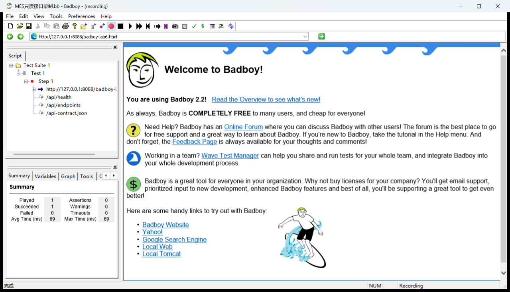

# 实验6 性能测试实验报告

课程：软件测试与质量保证    小组：第22组

测试对象：Keyboard MES后端    实验日期：2026年10月7日

## 1 实验目的与完成情况

依据课程上机6安排，本实验使用JMeter执行查询负载测试，并通过Badboy完成请求录制、脚本导出与回放。JMeter单用户基线和十用户负载共652个请求，均无失败；Badboy完成4个只读请求的录制，其原生脚本、原始导出JMX及补充响应断言的JMX均通过实际回放。

## 2 场景与环境

使用Apache JMeter 5.6.3和JDK 17，以非图形模式执行测试。JMeter安装包从Apache官方渠道下载，并通过SHA512核对。本机后端连接keyboard_mes_lab2隔离库和独立Redis 16379实例，业务数据保持原样。

每个线程先登录，随后循环访问工单列表、生产任务列表和生产概览，最后退出。三个查询都检查HTTP 200、业务码200和返回数据类型。每次业务查询前等待300毫秒，以避免无间隔请求；连接超时5秒、响应超时10秒。业务负载JMX由手工编写并实际运行；Badboy另行录制辅助页面与三个公共只读接口，用于验证录制、导出和回放流程。

| 场景 | 并发线程 | 业务循环次数 | 业务查询数 | 登录及退出请求 | 总请求数 |
| --- | --- | --- | --- | --- | --- |
| 单用户基线 | 1 | 每线程10次 | 30 | 2 | 32 |
| 十用户负载 | 10 | 每线程20次 | 600 | 20 | 620 |

## 3 实测结果

| 场景 | 统计范围 | 样本数 | 失败数 | 平均响应毫秒 | P95毫秒 | 最大毫秒 | 吞吐量每秒 |
| --- | --- | --- | --- | --- | --- | --- | --- |
| 单用户基线 | 全部请求 | 32 | 0 | 10.19 | 18 | 44 | 3.01 |
| 单用户基线 | 业务查询 | 30 | 0 | 9.27 | 15 | 18 | 2.82 |
| 十用户负载 | 全部请求 | 620 | 0 | 4.95 | 9 | 39 | 26.91 |
| 十用户负载 | 业务查询 | 600 | 0 | 4.93 | 9 | 13 | 26.04 |

表中业务查询均值和P95仅包含三个业务接口；全部请求统计包含登录和退出。P95采用按响应时间排序后的第95百分位样本，吞吐量按各场景第一条请求开始至最后一条请求结束的时间计算，包含升压和等待时间。

两次运行共652个请求，所有HTTP与业务断言通过。十用户场景在本机短时查询中未出现错误；其较低平均响应时间也可能受缓存预热和请求组合影响，不能仅凭两组均值推断并发增大后性能必然改善。

## 4 Badboy录制与回放

Badboy 2.2.5安装于D:\Badboy。最初通过COM创建的实例在HTTP导航时出现mfc90u.dll异常，而普通GUI启动的实例能正常访问同一页面。经过对照，最终采用正常GUI进行录制，通过原生菜单保存脚本和导出JMX；COM自动化方式仍存在异常，后续复现按GUI操作进行。

为适配旧浏览器，本次用简单HTML辅助页面发起同源只读请求。页面打开后，依次点击健康检查、接口索引和接口契约按钮，Badboy实际记录了页面请求及三个接口请求。辅助页面明确标注其录制用途，测试没有创建或修改业务数据。

图1 重新打开原始录制文件后的Badboy请求树

| 回放方式 | 请求数 | 失败数 | 验证内容 |
| --- | --- | --- | --- |
| Badboy自带bbcmd回放 | 4 | 0 | 原始.bb可加载，四个请求均返回200 |
| JMeter原始导出回放 | 4 | 0 | 原生导出JMX可由JMeter5.6.3直接执行 |
| JMeter响应断言回放 | 4 | 0 | 检查HTTP状态、业务成功码和响应关键字段 |

原始导出只提供请求回放，补充断言的版本进一步检查健康状态为UP、业务码为200、接口索引数据存在，以及契约包含resources和operations。辅助页面也校验页面用途文本。两份JMX分别保存，原始导出文件保持原样。以上4个录制请求用于工具流程验证，未计入前述652个负载请求。

## 5 实验总结

本次建立了可重复的查询负载，并通过业务断言区分请求成功与业务成功。结果适用于本机已有数据下的短时只读场景，尚不足以评价长期稳定性、写入吞吐或生产容量。Badboy录制、导出和回放已完成，后续可根据明确的性能需求扩展用户量、持续时间和业务组合。
